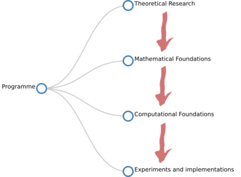
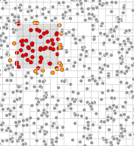
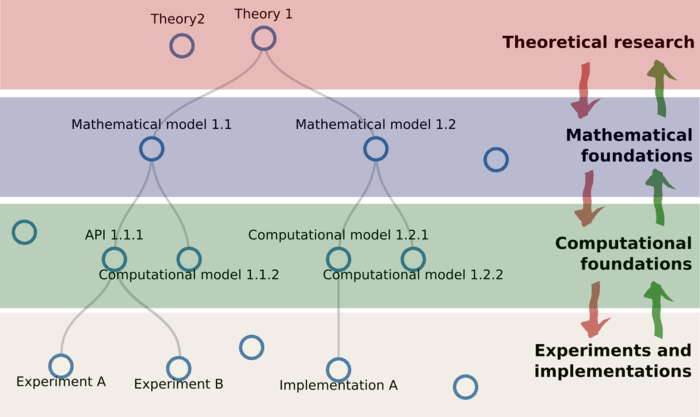
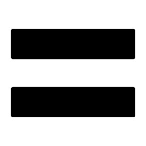
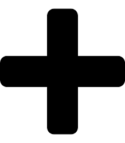
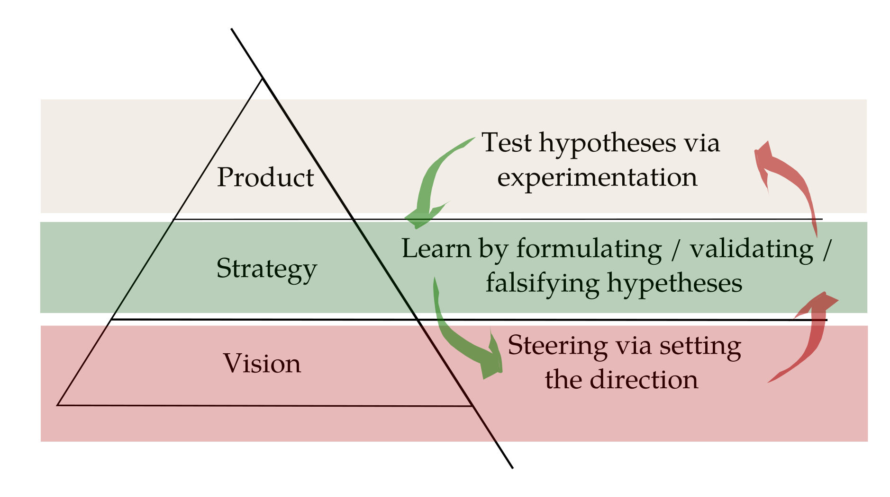
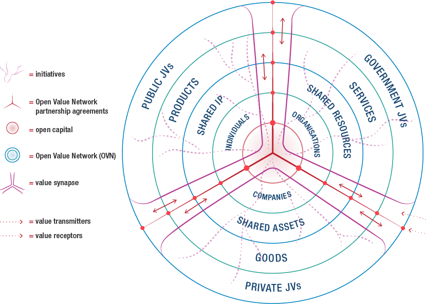
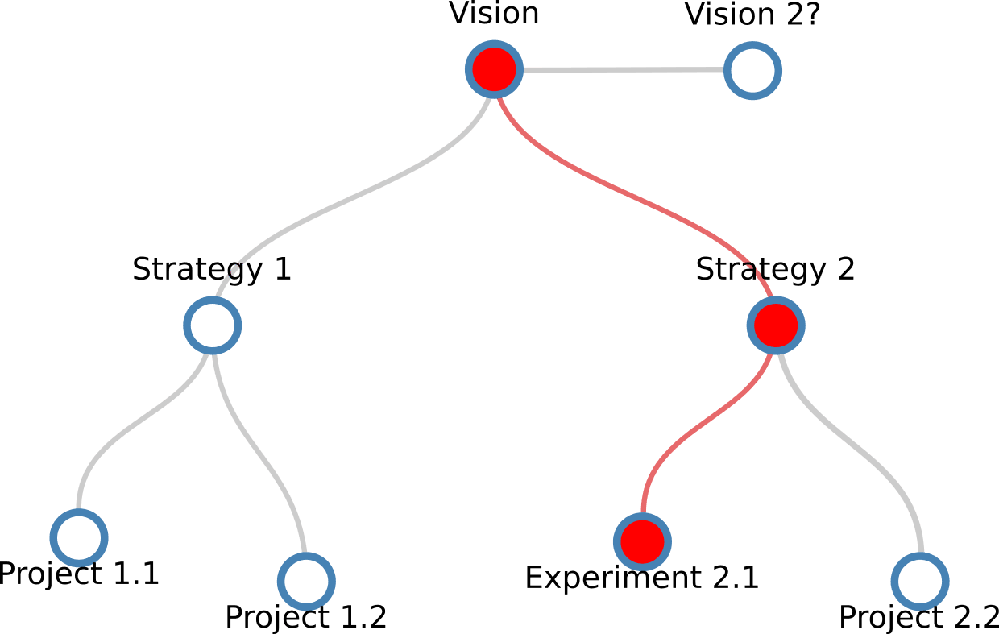
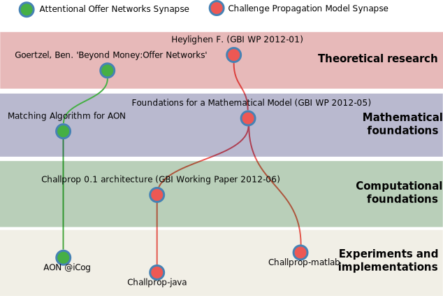
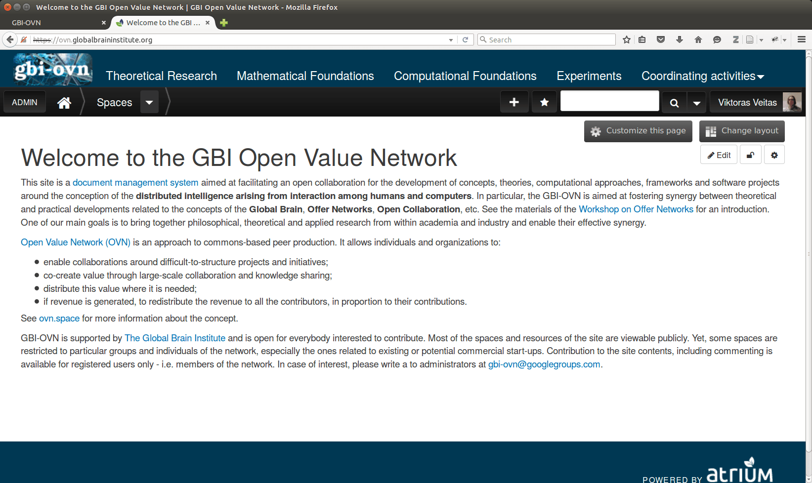

# Motivation

## Why?

* We want to collaborate on researching and implementing our visions;
    * We want this collaboration to be free of constraints on which vision and how we should pursue individually;
    * Yet, our individual work should contribute to the overall vision and draw inspiration / ideas / knowledge from others;
  
* This does not go easy:
    * We have a number of projects (both internally and externally) which revolve around the same ideas yet are somewhat isolated:
        * Challenge propagation, chemical organization theory, offer networks, FutureICT, Computing in the Web, Holomidal Collective Intelligence, Ceptr, etc...

## What?

* Combine two kinds of thinking:
    * Conceptual guidance (philosophers, scientists, theoreticians, ...);
    * Unconstrained experimentation (entrepreneurs, hackers, developers, ...);

<div class="columns-2" style="width:850px;">
   
   
</div>

## Knowledge flows

* We want both conceptual guidance and unconstrained experimentation:
  

<button class="notesButton" onclick="toggleNotes()">notes</button> 
<div class="notes">
- There is loose connection between areas;
- Knowledge flows openly both bottom up and top down;
- Forms 'value chains';
- Chains can be started in any area;
- Some projects / initiatives will not get connected to chains...
</div>

## Purpose

* Create more value via collaboration:
    * Connect the areas without constraining activities within them;
    * Attract people who are doing relevant research for sharing;
* Distribute the created value among participants;

## How? {.build}

<div class="centered" style="font-size:110%;font-weight:bold;">
GBI Open Value Network 
<br/>
([GBI-OVN](https://ovn.globalbraininstitute.org))
</div>

<div class="centered">

</div>

<div class="centered" style="font-size:110%;font-weight:bold;">
Lean startup methodology
<br/>
([Lean startup](https://en.wikipedia.org/wiki/Lean_startup))
</div>

<div class="centered">

</div>

<div class="centered" style="font-size:110%;font-weight:bold;">
 Open Value Networks paradigm
 <br/>
 ([OVN Initiative](http://cargo.notthisbody.com/Open-Value-Networks))
</div>

<button class="notesButton" onclick="toggleNotes()">notes</button> 
<div class="notes">
* No need to present these concepts in full - will only introduce aspects which are relevant to GBI-OVN..
</div>

# Lean startup <br/>methodology

## Define $\rightarrow$ experiment $\rightarrow$ learn loop {.build}

<div class="centered">

</div>

## Executing the loop

<head>
<script type="text/javascript" src="http://d3js.org/d3.v3.min.js"></script>
<script src="jquery-1.11.3.min.js"></script>
</head>

<div class="centered">
```{r child = 'pictures/lean_startup_process/lean_startup_process.svg'}
```
</div>

<button class="notesButton" onclick="toggleNotes()">notes</button> 
<div class="notes">
* The movement through the loop should be as fast as possible (the concept of MVP);
* But **not** faster than needed to facilitate learning; 
</div>

<button class="stepButton" onclick="toggleStep()">steps</button> 
<script>
```{r child = 'pictures/lean_startup_process/script.js'}
```
</script>

## A closer look

<div class="right">
```{r child = 'pictures/lean_startup_process/lean_learning.svg'}
```
</div>


<button class="notesButton" onclick="toggleNotes()">notes</button> 
<div class="notes">
We see:

<ul>
<li>a layered process;</li>
<li>separation between layers;</li>
<li>define $\rightarrow$ experiment $\rightarrow$ learn <br/>loop connects them;</li>
<li>can be generalized to any number of layers;</li>
</ul>

Interdisciplinary research environments:

<ul>
<li>more exploration;</li>
<li>more diverse areas of inquiry;</li>
<li>connections are not obvious;</li>
<li>how to facilitate large scale collaborations?</li>
</ul>

</div>

# Open Value <br/>Networks

## A framework for open collaboration

* Allows for:
    * Co-creation of value through large-scale collaboration;
    * Distribution of value where it is needed;

* Via:
    * 'Stigmergic' and 'directed' resource sharing (incl. knowledge) among diverse initiatives and sub-communities;
    * Self-organization of <strong>"value synapses"</strong> (as contrasted with definition of value chains);
    * Trust, implicit and explicit partnership agreements;
    * Governance paradigm for loosely defined initiatives;
    

## 

<div class="centered">

</div>

<button class="notesButton" onclick="toggleNotes()">notes</button> 
<div class="notes">

</div>

<script>
function toggleNotes() {
    document.body.classList.toggle('with-notes');
}
</script>

## Applicability

* Open Value Networks is a general framework;
* It reveals its power (and actually is created) via pilot projects, e.g.:
    * Sensorica.co [http://www.sensorica.co/](http://www.sensorica.co/) - open hardware network;
    * Metamaps.cc [http://metamaps.cc/](http://metamaps.cc/) - real-time sense-making software;
    * ...?
* There are no ready-made solutions, but many tools, approaches and guidelines which should be adapted to specific circumstances;

# GBI-OVN

<button class="notesButton" onclick="toggleNotes()">notes</button> 
<div class="notes">
A proposal for bootstrapping the development of GBI Open Value Network as a long term programme. 

First steps:

<ul>
<li>Definition of the structure of the network;</li>
<li>Creation of medium for cooperation;</li>
</ul>

</div>

## Structure of the network

<div class="centered">

</div>

<button class="notesButton" onclick="toggleNotes()">notes</button> 
<div class="notes">
<ul>
<li>Value synapses self-organize during operation of the network;</li>
<li>For financing purposes (and not only), synapses can also be described as separate sub-projects;</li>
</ul>
</div>


## Medium of cooperation

[https://ovn.globalbraininstitute.org](https://ovn.globalbraininstitute.org)

<button class="notesButton" onclick="toggleNotes()">notes</button> 
<div class="notes">
<ul>
<li>Network governance - also a sub-project which could apply for financing;</li>
</ul>
</div>

<div class="centered">

</div>


## Structure of the network (2)

<iframe src="pictures/structure/gbi-ovn_synapses_included.svg" class="centered" frameborder="0" scrolling="no" id="iframe">
</iframe> 


## Vision

* GBI-OVN: 
    * is a value (scientific, monetary, otherwise) creation, sharing and distribution network based on the synergy of internal and external resources and people;
    * aims at facilitating and governing the large scale collaboration towards developing The Global Brain theory and technologies;
    * The network guides the self-organization of diverse expertise, knowledge, resources and financial sources (EU funds, commercial projects, philanthropy), people and ideas sharing the same broad vision.

    
## Further steps

* Acknowledge the shared understanding;
* Define the project's governance;
* Outline foreseeable scope of work required for the project;
* Build, collaborate, suggest, search, integrate, experiment...
